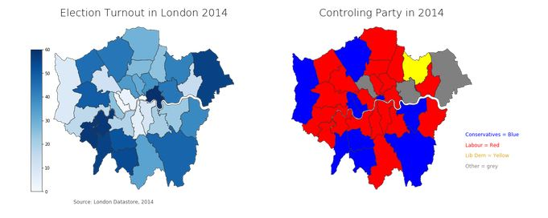

# London-Election-2014
Uses Pandas,Geopandas and Matplotlib to create a visual of the turnout and controlling parties of the 2014 London Election. The full code can be found in the "London.ipynb" file.

